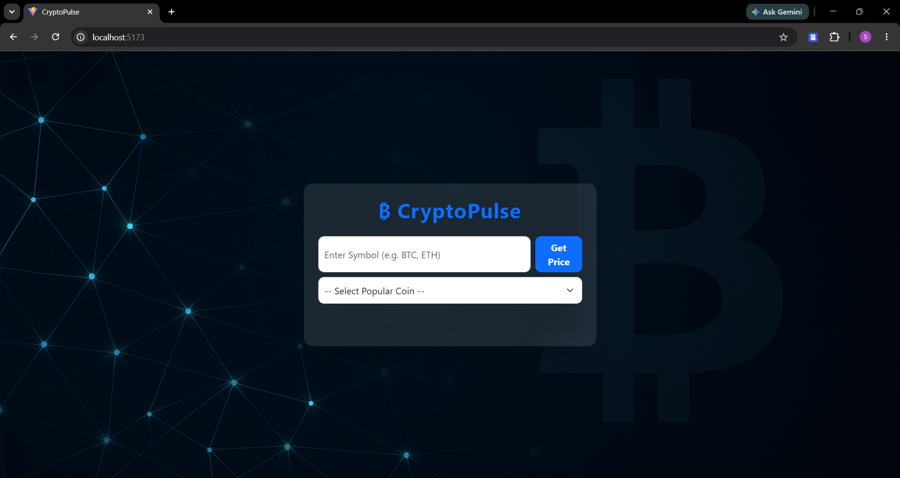
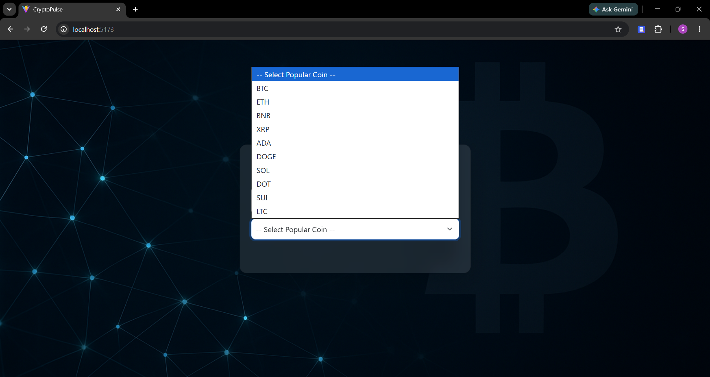
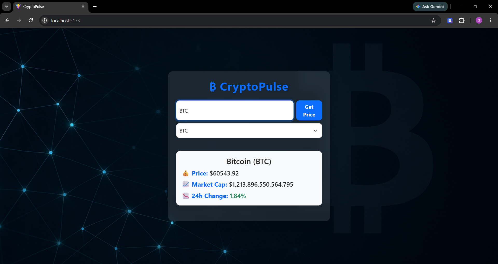
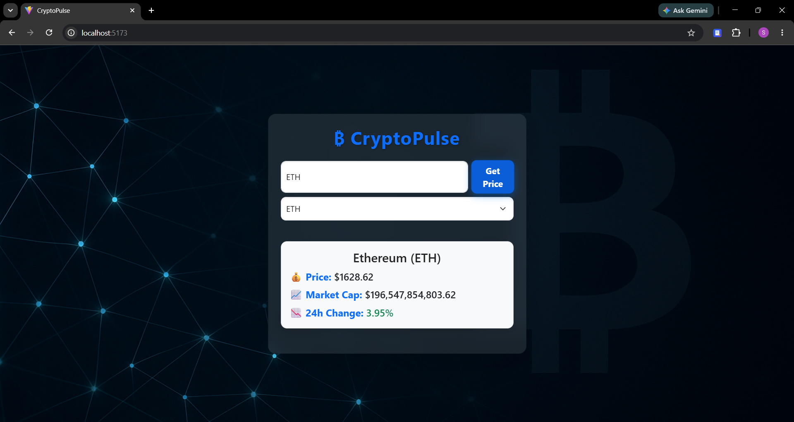

# 🚀 CryptoPulse


A modern **full-stack cryptocurrency tracker** built with **React**, **Express.js**, and the **CoinMarketCap REST API**. CryptoPulse allows users to search for cryptocurrencies and retrieve real-time market information including current price, market capitalization, and 24-hour price changes.

---

## 🌐 Live Demo

🚀 **Frontend:** [CryptoPulse Live](https://crypto-pulse-six-amber.vercel.app/)

⚙️ **Backend API:** [Render API](https://cryptopulse-api-rtg6.onrender.com)

> **Note:** The backend is hosted on Render's free tier. If the application has been idle, the first request may take 30–60 seconds while the backend wakes up.

---

# 📖 About the Project

CryptoPulse is a responsive full-stack web application that demonstrates REST API integration by fetching live cryptocurrency data from the CoinMarketCap API.

The application enables users to:

* Search cryptocurrencies using their symbols.
* Select popular cryptocurrencies from a dropdown.
* View live market prices.
* Monitor market capitalization.
* Track 24-hour price changes.
* Automatically refresh market data every 30 seconds.

This project showcases modern frontend development, backend API integration, environment variable management, and cloud deployment.

---

# ✨ Features

* 🔍 Search cryptocurrencies by symbol
* 📋 Popular cryptocurrency dropdown
* 💰 Live cryptocurrency prices
* 📈 Market capitalization
* 📉 24-hour price changes
* 🔄 Auto-refresh every 30 seconds
* ⚡ Fast React + Vite frontend
* 🔐 Secure API key management using environment variables
* 📱 Responsive Bootstrap interface
* ☁️ Deployed on Vercel & Render

---

# 🛠️ Tech Stack

## Frontend

* React.js
* Vite
* Bootstrap 5
* JavaScript (ES6)
* CSS3

## Backend

* Node.js
* Express.js
* Axios
* CORS
* Dotenv

## API

* CoinMarketCap REST API

## Deployment

* Vercel (Frontend)
* Render (Backend)

---

# 📂 Project Structure

```text
CryptoPulse/
│
├── backend/
│   ├── server.js
│   ├── package.json
│   └── .env
│
├── frontend/
│   ├── public/
│   ├── src/
│   ├── package.json
│   ├── vite.config.js
│   └── .env
│
├── screenshots/
│   ├── Img1.png
│   ├── Img2.png
│   ├── Img3.png
│   └── Img4.png
│
├── README.md
└── .gitignore
```

---

# ⚙️ Installation

## Clone the Repository

```bash
git clone https://github.com/Santosh-S321/CryptoPulse.git
cd CryptoPulse
```

---

## Backend Setup

```bash
cd backend
npm install
```

Create a `.env` file:

```env
CMC_API_KEY=YOUR_COINMARKETCAP_API_KEY
```

Start the backend:

```bash
npm start
```

Backend runs at:

```
http://localhost:5000
```

---

## Frontend Setup

```bash
cd frontend
npm install
```

Create a `.env` file:

```env
VITE_API_URL=http://localhost:5000
```

Run the frontend:

```bash
npm run dev
```

Open:

```
http://localhost:5173
```

---

# 📷 Screenshots

## 🏠 Home Page



---

## 📋 Popular Cryptocurrency Dropdown



---

## ₿ Bitcoin Information



---

## 💎 Ethereum Information



---

# 🔗 API Endpoint

```
GET /api/crypto/:symbol
```

Example:

```
GET /api/crypto/BTC
```

---

# 🚀 Future Enhancements

* 📈 Interactive price charts
* ⭐ Favorite cryptocurrencies
* 🔍 Search autocomplete
* 🌙 Dark mode
* 🌍 Multi-currency support
* 📊 Historical market data
* 📱 Progressive Web App (PWA)
* 📉 Price alerts

---

# 📈 Learning Outcomes

Through this project, I gained experience with:

* REST API integration
* Full-stack application development
* React Hooks (`useState`, `useEffect`)
* Express.js backend development
* Environment variable management
* HTTP requests using Axios
* Cloud deployment using Vercel and Render
* Git and GitHub version control

---

# 👨‍💻 Author

**Santosh S**

🎓 B.E. Computer Science Engineering

🔗 GitHub: https://github.com/Santosh-S321

